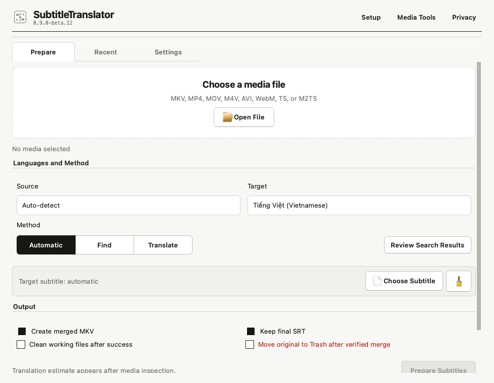

# SubtitleTranslator

SubtitleTranslator is a free macOS utility for finding, translating,
synchronizing, cleaning, and merging soft subtitles. It supports dual-subtitle
playback in mpv and works with media stored anywhere the user chooses.

The app has no account, telemetry, analytics, or developer-operated server.
OpenAI and OpenSubtitles requests are sent directly from the Mac using API keys
stored in macOS Keychain.



## Features

- Inspects text and image subtitle tracks embedded in common media containers.
- Finds sidecar subtitles in explicitly selected media folders and their nested
  subtitle directories.
- Uses the best available subtitle language as the timing and translation
  source.
- Searches the official OpenSubtitles REST API with hash and title matching.
- Offers manual review when search results are plausible but not safe to select
  automatically.
- Pauses Automatic mode when search candidates fail timing validation, shows
  rejection details, and requires an explicit cost-disclosed action before
  translating through OpenAI.
- Translates text subtitles with configurable OpenAI models and reasoning.
- Includes editable source/target-aware prompt profiles for 30 languages.
- Localizes the complete application interface into the same 30 languages,
  with automatic macOS locale detection and RTL layouts where appropriate.
- Detects constant offsets, gradual drift, incompatible cuts, and local timing
  discontinuities across the full runtime.
- Tries alternate OpenSubtitles candidates when timing cannot be reconciled.
- Removes style and positioning instructions from text subtitles so mpv
  controls their locations consistently.
- Preserves one full embedded PGS source track when no text source exists,
  without OCR or image re-encoding.
- Creates verified MKV output without re-encoding video or audio.
- Launches current or recent media directly in the user's normal mpv setup.
- Cancels searches, translations, audio analysis, and muxing without leaving a
  partial MKV behind.
- Exports user-controlled, redacted diagnostics with timing and candidate
  decisions but no API keys, subtitle dialogue, or full media paths.
- Includes Economy, Balanced, and Best translation presets with a local,
  preflight cost range.

## Supported Languages

English, Vietnamese, Korean, Japanese, Simplified Chinese, Traditional Chinese,
Spanish, Brazilian Portuguese, European Portuguese, French, German, Italian,
Russian, Ukrainian, Polish, Dutch, Turkish, Arabic, Persian, Hebrew, Hindi,
Bengali, Urdu, Indonesian, Malay, Thai, Filipino, Romanian, Czech, and Greek.

All 30 languages can be used as source or target languages. Unidentified text
subtitles can still provide timing evidence, but their source language must be
selected before translation.

## Interface Languages

The interface follows the Mac's preferred language on first launch and falls
back to English when needed. Interface language is independent of subtitle
source and target languages. Change it under **Settings > Interface** and
restart the app to apply it.

Language choices are always shown with native and English names. Arabic,
Persian, Hebrew, and Urdu use right-to-left layouts; paths, commands, API fields,
and editable translation prompts remain left-to-right.

All 30 launch catalogs are machine-generated drafts. Corrections are welcome
through the editable Qt `.ts` files in `translations/`. Compact localized
installation guides are available in [`docs/i18n`](docs/i18n/).

## Install

1. Download the universal DMG from
   [GitHub Releases](https://github.com/daniel-p-berg/SubtitleTranslator/releases).
2. Open the DMG and drag `SubtitleTranslator.app` onto its Applications
   shortcut.
3. Because this beta is not notarized, try to open it once, then choose
   **System Settings > Privacy & Security > Open Anyway** and confirm the
   first launch.
4. Complete the readiness checklist for media tools, optional API connections,
   a media folder, mpv, and a first media file.
5. If Homebrew is missing, choose **Install Homebrew**, use the official signed
   macOS installer, and return to choose **Check Again**.
6. Choose **Install Missing Tools**. SubtitleTranslator shows the exact command,
   opens it in a visible Terminal window, and detects when installation finishes.
   macOS may ask once for permission to open Terminal.

The equivalent manual command is:

```bash
brew install ffmpeg mkvtoolnix mpv
```

The single universal build runs natively on both Apple Silicon and Intel Macs.
macOS 13 or newer is required.

## API Setup

### OpenAI

1. Create an API key at the
   [OpenAI API key page](https://platform.openai.com/api-keys).
2. Confirm API billing and model access in the OpenAI account.
3. Open **Settings > API Connections**, enter the key, and choose
   **Save API Keys to Keychain**.
4. Use **Test** to validate the selected model without submitting subtitle text.

The existing default remains `gpt-5.6-luna` with low reasoning. Settings also
offers three one-click profiles:

| Preset | Model | Reasoning |
| --- | --- | --- |
| Economy | `gpt-5.6-luna` | Low |
| Balanced | `gpt-5.6-terra` | Low |
| Best | `gpt-5.6-sol` | High |

The model selector is limited to GPT-5.6 Luna, Terra, and Sol. Reasoning can be
set from Low through Maximum. Cost ranges use the short-context standard token
rates published on the [OpenAI pricing page](https://developers.openai.com/api/docs/pricing)
and are estimates rather than spending limits. The bundled rates were last
reviewed on July 30, 2026.

### OpenSubtitles

1. Sign in or create an account at
   [OpenSubtitles](https://www.opensubtitles.com/).
2. Create an API consumer key from the
   [API consumers page](https://www.opensubtitles.com/en/consumers).
3. Add it under **Settings > API Connections** and save it to Keychain.

The app does not read API keys while opening. When a workflow first needs a
saved key, **Allow** grants that request and the app caches the value for the
rest of the launch. **Always Allow** also prevents another request the next
time that installed build opens. OpenAI and OpenSubtitles are separate
Keychain items, so a workflow that uses both services may request each one.

Subtitle availability, rate limits, and download quotas are controlled by
OpenSubtitles.

## File Behavior

- Choose any individual media file from the Prepare screen.
- Individually chosen and generated media are remembered as exact recent-file
  paths; choosing one does not approve its parent folder for scanning.
- Add one or more media folders when recursive recent-file access and nested
  sidecar discovery are desired.
- The app recursively scans only folders explicitly added by the user.
- The original media stays in place and remains unmodified.
- Working subtitles default to:

  ```text
  ~/Library/Application Support/SubtitleTranslator/Workspace/
  ```

- Final SRT and MKV files are written beside the source by default.
- A global custom output folder can be selected in Settings.
- Existing files are never overwritten; numbered filenames are created.
- Working subtitles can be cleaned after a successful job.
- Moving the original to Trash is an explicit per-job option available only
  when creating a replacement MKV.

## mpv Dual Subtitles

Open **Media Tools** in SubtitleTranslator and leave **Include optional mpv
player** selected before choosing **Install Missing Tools**. The equivalent
manual command is:

```bash
brew install mpv
```

Open **Settings > Video Playback > Dual Subtitle Setup**. The assistant shows
the exact proposed `~/.config/mpv/mpv.conf`, preserves unrelated settings,
warns about duplicate keys, creates a timestamped backup, and can restore the
latest backup. Choose the preferred language for each role as well as its
position; these choices persist and are passed explicitly whenever the app
launches mpv.

Its managed block contains:

```conf
# BEGIN SubtitleTranslator dual subtitles
# Primary subtitle: English
# Secondary subtitle: Vietnamese
slang=eng,vie
sid=auto
sub-pos=90
secondary-sub-pos=10
secondary-sub-visibility=yes
secondary-sid=auto
# END SubtitleTranslator dual subtitles
```

Successful merged outputs remain in the **Recent** tab after restarting the
app. Double-click an item or select it and choose **Open in mpv**. **Open File**
can launch an existing media file that is not yet in the list.

Useful default controls:

| Control | Action |
| --- | --- |
| `g-s` | Select the primary subtitle |
| `g-S` | Select the secondary subtitle |
| `Alt+v` | Toggle the secondary subtitle |

SubtitleTranslator outputs clean SRT tracks without embedded positioning. When
the only usable source subtitle is PGS, the app preserves one full PGS track
losslessly and its launcher selects that authored bitmap track as primary while
placing the translated text track at the top as secondary. It does not
automatically pair two bitmap tracks because their authored positions could
overlap. See the [mpv manual](https://mpv.io/manual/stable/) for additional
styling, language, and delay options.

## Translation Prompts

The prompt system combines:

- Structural SRT requirements shared by every translation.
- Guidance for the detected or selected source language.
- Guidance for the selected target language.

Each target template is visible under **Settings > Translation**. Templates can
be edited, saved per language, or reset. `{source_name}` and `{target_name}`
must remain in custom templates, and timestamp-preservation instructions are
validated before saving.

## Timing Strategy

The pipeline prefers timing evidence in this order:

1. Embedded text subtitle from the selected media.
2. Validated sidecar text subtitle.
3. Embedded or sidecar image-subtitle packet timing.
4. Coarse local audio activity as a last-resort guardrail.

Translated subtitles inherit the source cue timings. Existing target-language
subtitles are checked across the runtime for offset, drift, and discontinuities.
Low-confidence candidates are rejected when alternatives can be tested. If
none passes, the app returns to review with rejection details and waits for the
user to choose another result, cancel, or explicitly approve translation after
seeing its estimated cost.

Choose **Export Diagnostics** after a completed, failed, or cancelled job to
save a private JSON report. It records timing confidence and corrections,
candidate acceptance/rejection, API retry metadata, translation token usage,
and local tool versions. It never includes API keys, authorization headers,
subtitle dialogue, or full media paths.

Image subtitle formats such as PGS and VobSub contain pictures rather than
translation text. They can help with timing, but this beta does not perform OCR
or audio transcription.

## Privacy

Read [PRIVACY.md](PRIVACY.md) for the exact local and network data boundary.
In short:

- API keys are stored in macOS Keychain.
- Media files are processed locally.
- Subtitle text goes to OpenAI only for a requested translation.
- Search metadata goes to OpenSubtitles only for a requested or automatic
  search.
- No data is sent to the developer.

## Development

```bash
git clone https://github.com/daniel-p-berg/SubtitleTranslator.git
cd SubtitleTranslator
python3.12 -m pip install -r requirements-dev.txt
python3.12 tools/build_translations.py --check
python3.12 tools/build_translations.py --compile
python3.12 test_pipeline.py
python3.12 -m unittest -v test_product.py
python3.12 main.py
```

Build a local unsigned release:

```bash
bash build.sh
```

Release automation builds and verifies one universal2 artifact on GitHub
Actions. See [CONTRIBUTING.md](CONTRIBUTING.md), [SECURITY.md](SECURITY.md),
and [THIRD_PARTY_NOTICES.md](THIRD_PARTY_NOTICES.md) before submitting changes.

## License

SubtitleTranslator is released under the [MIT License](LICENSE). FFmpeg,
MKVToolNix, mpv, Qt/PySide, and API services have their own licenses and terms.
See [Third-Party Notices](THIRD_PARTY_NOTICES.md) for bundled components.
